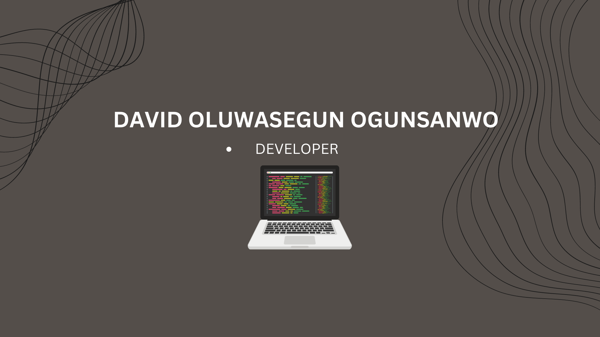

### Hi there , welcome to my profile.

---
<h1 align="center">I'm David Olu</h1>

  

 

---

<h3 align="left">Tech Stack:</h3>

           <!-----> 

 

---
### About Me

- I'm a web developer and I use **Django**

- I am mostly self-taught & been a programmer has been an amazing journey for me as I get to discover and explore new things in this world of science and technology.

- I am a professional Badminton coach & athlete 

 

---

<h3 align="left">🔗 Connect with me:</h3>
 

<!--
**tomitokko/tomitokko** is a ✨ _special_ ✨ repository because its `README.md` (this file) appears on your GitHub profile.

Here are some ideas to get you started:

- 🔭 I’m currently working on ...
- 🌱 I’m currently learning ...
- 👯 I’m looking to collaborate on ...
- 🤔 I’m looking for help with ...
- 💬 Ask me about ...
- 📫 How to reach me: ...
- 😄 Pronouns: ...
- ⚡ Fun fact: ...
-->
